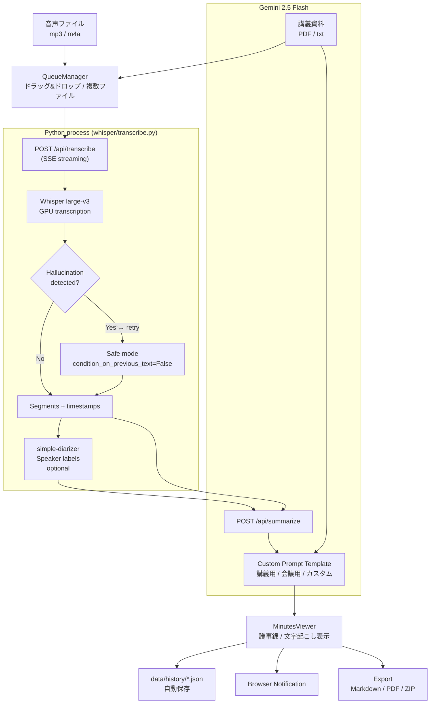

# Lecture Minutes Generator


音声ファイル（mp3 / m4a）をアップロードするだけで、**Whisper による文字起こし → Gemini による議事録生成**をローカルで完結させる Web アプリ。大学講義の学習効率最大化と、API コスト問題・ハルシネーション問題を同時に解決するために個人開発。

<!-- TODO: デモ GIF またはスクリーンショットを追加 -->

---

## Motivation

既存のクラウド型文字起こしツールには2つの根本的な問題がありました。

1. **コスト** — API 従量課金では長時間講義を毎日処理すると費用がかさみ、学生が継続できない
2. **Hallucination** — 専門用語・固有名詞が多い講義では LLM が誤内容を生成し、そのまま試験勉強に使うと逆効果になる

これらを解決するため、**Whisper をローカル GPU で実行してゼロコスト化**し、**講義資料を RAG として注入して hallucination を抑制**する仕組みを自作しました。
実際の大学講義で継続使用した結果、小テストで満点を維持。[ココナラで商用版を出品中](https://coconala.com/services/4196322?ref=top_histories&ref_kind=home&ref_no=1)。

---

## Features

| | 機能 | 説明 |
|---|---|---|
| ✅ | Whisper local transcription | large-v3 / medium / small / base を切り替え可能。GPU (CUDA) で高速動作 |
| ✅ | Gemini minutes generation | カスタム Prompt Template 対応（講義用・会議用プリセット付き） |
| ✅ | Real-time SSE streaming | Whisper の進捗（%）をリアルタイム表示。モデル download 中も進捗バー表示 |
| ✅ | Hallucination auto-detection | 定型文ループ・出力長・no_speech_prob で誤認識を検知し自動 retry |
| ✅ | RAG via lecture materials | PDF / txt を Gemini API の inlineData で同時送信し専門用語精度を向上 |
| ✅ | Speaker diarization | simple-diarizer で `[00:01] 話者A: ...` 形式で複数話者をラベル付け |
| ✅ | Multi-file queue | ドラッグ＆ドロップで複数ファイルを登録し順次処理。AbortController でキャンセル可 |
| ✅ | Selective re-analysis | タイムスタンプ行をチェックボックスで選択し、指定箇所のみで再生成 |
| ✅ | Inline editing | 議事録を画面内で直接編集・保存 |
| ✅ | Audio player + sync highlight | 再生位置に合わせて文字起こし行をハイライト。行クリックでシーク |
| ✅ | Bulk ZIP export | 全履歴の議事録・文字起こし・JSON を fflate でブラウザ側圧縮して一括 download |
| ✅ | Processing statistics | 月別件数グラフ・モデル別平均処理時間・累計処理時間 |
| 🔲 | Google Drive auto-save | 処理完了時に Drive へ自動アップロード |
| 🔲 | Mobile responsive layout | スマートフォンからの閲覧・操作に対応 |
| 🔲 | Multi-language support | 日本語以外の講義に対応（Whisper の language 設定を UI から変更可能に） |

---

## Tech Stack

| Category | Technology | 採用理由 |
|---|---|---|
| Frontend | Next.js 16.2 (App Router) | React Server Components + file-based routing で最小構成 |
| Language | TypeScript 5 | 型安全性と IDE 補完でコンポーネント間の Props ミスを防止 |
| Styling | Tailwind CSS v4 | カスタムベージュパレット（`sand-*`）を CSS 変数で定義。ユーティリティで高速 UI 実装 |
| Speech-to-Text | OpenAI Whisper large-v3 (local) | ゼロコスト・オフライン動作・日本語精度が最高水準 |
| LLM | Google Gemini 2.5 Flash | 長い transcript を一度に処理できる large context window、低レイテンシ |
| RAG | Gemini inlineData (PDF / txt) | 外部 Vector DB 不要。講義資料をそのまま multimodal input で送信 |
| Speaker Diarization | simple-diarizer (MIT) | pyannote.audio と異なり商用利用可能なライセンス |
| Runtime | Python 3 + PyTorch nightly cu128 | RTX 5070 (sm_120) での CUDA 動作に nightly build が必要 |
| Streaming | SSE (Server-Sent Events) | WebSocket より実装が軽量。Python stdout → Node.js → Browser のパイプ |
| ZIP Export | fflate | ブラウザ側で圧縮することでサーバー負荷なし |
| Data | JSON files + localStorage | DB 不要のゼロ依存構成。個人利用に必要十分 |

---

## Architecture



---

## Getting Started

### Prerequisites

- Node.js 18 以上
- Python 3.11 以上
- NVIDIA GPU (CUDA 12.8 対応) — CPU でも動作しますが処理速度が大幅に低下します
- Google AI Studio API キー ([取得はこちら](https://aistudio.google.com/app/apikey))

### Installation

```bash
# 1. Clone
git clone https://github.com/haruto-miyakawa/lecture-minutes.git
cd lecture-minutes

# 2. Node.js dependencies
npm install

# 3. Python virtual environment
python -m venv .venv

# Windows
.venv\Scripts\activate
# macOS / Linux
source .venv/bin/activate

# 4. Whisper + PyTorch (CUDA 12.8 / RTX 5070)
pip install openai-whisper
pip install --pre torch --index-url https://download.pytorch.org/whl/nightly/cu128

# CPU のみの場合
pip install torch

# 5. Speaker diarization（任意）
pip install simple-diarizer

# 6. Environment variables
cp .env.example .env.local
# .env.local を編集して GOOGLE_API_KEY を設定
```

### Environment Variables

`.env.local` に以下を記載してください（`.env.example` を参照）。

```env
GOOGLE_API_KEY=your_gemini_api_key_here
```

### Run

```bash
npm run build
npm start
# → http://localhost:3000
```

> **初回起動時**: Whisper の `large-v3` モデル（約 3GB）が `~/.cache/whisper/` へ自動 download されます。進捗はブラウザの UI に表示されます。

---

## Implementation Notes

### なぜ SSE で Whisper の進捗を取得するのか
Whisper は Python プロセスとして起動するため、Node.js から直接進捗を取得できません。
`tqdm` を monkey-patch して `update()` メソッドで JSON 行を stdout に emit し、Node.js が SSE に変換してブラウザへ転送する構成にしました。
モデル download 中は `unit == 'iB'`（バイト単位）で識別し、`type: "downloading"` と `type: "progress"` を区別しています。

### Hallucination 検知の設計方針
精度優先設定（`condition_on_previous_text=False` / `no_speech_threshold=0.4`）は通常時は適用せず、3条件（定型文フレーズ一致 / 出力文字数が音声長に対して極端に少ない / `no_speech_prob` 平均が 0.7 超）のいずれかで検知した場合のみ自動 retry します。
通常時の精度を落とさずフォールバックとして機能させる設計です。

### QueueManager を常時マウントする理由
`MinutesViewer` を前面表示中もキュー処理を継続させるため、コンポーネントを unmount せず `hidden` CSS クラスで切り替えています。unmount するとキューの状態が消えてしまうためです。

### stale closure 対策
`onSaveHistory` などの非同期 callback は `useRef` でラップして常に最新の関数を参照します。
`useCallback` の依存配列に含めると不必要な re-render が発生するため、Ref 経由のアクセスで解決しています。

### ライセンスと依存ライブラリの選定
Speaker diarization ライブラリは pyannote.audio の学習済みモデルが非商用限定のため、commercial use が可能な `simple-diarizer` (MIT) を採用しました。

### Windows 固有の対応
`sys.stdout.reconfigure(encoding='utf-8')` で Shift-JIS による文字化けを防止。
`.venv` の Python パスを絶対パスで指定することで、CUDA 関連ライブラリを確実に読み込む構成にしています。

---

## Roadmap

- [ ] Google Drive への自動保存（処理完了時に Drive ドキュメントとして出力）
- [ ] Mobile responsive layout（スマートフォンからの閲覧・操作）
- [ ] Multi-language support（`language` パラメータを UI から設定可能に）
- [ ] Whisper.cpp 対応（より高速な inference エンジンへの切り替えオプション）
- [ ] Notion export（議事録を Notion ページとして直接出力）

---

## License

[CC BY-NC-ND 4.0](LICENSE) — 参照・閲覧は自由ですが、商用利用・改変・再配布は禁止です。

Copyright (c) 2026 Haruto Miyakawa
